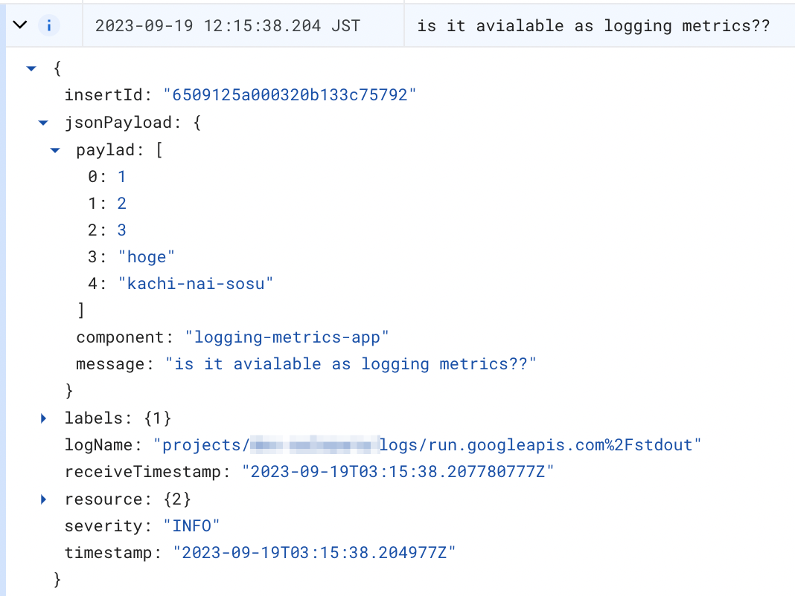

Cloud Run の Logging って使ってるとたまに `{` とかだけが出力されてて, 標準出力に pretty print してるだけなんやけどなーって、お気持ちになるので, 未来の自分のために一筆残しとく.

## やりたいことと背景

整理する前にそもそもやりたいことがあってまずはその整理から.

### その 1 severity を error にしないけど stacktrace を出したい

なんらかの Exception が throw されたら catch して exponential backoff しながら retry するっていう util function がすでに存在するんやけど, 雑に

```javascript
try {
  // do something
} catch (e) {
  console.error(e);
}
```

こんなふうに書いてたら割りとよく起こる Exception (それ自体をつぶせっていう話はあるんやけど, 一旦はそれは置いといて) がじゃんじゃか Error Report に届いてしまって困った(てる).
かといって, `e.message` だけを出力するようにするとマジの Exception になったときに困る.

ので, retry 中に起こった Exception に関しては severity を warn で出力したい

### その 2 Log Metrics に使えるように折りたたみ可能な jsonPayload として出力したい

任意の severity で label をくっつけて出力するってのは, 公式にも[ドキュメント](https://cloud.google.com/run/docs/logging#writing_structured_logs)があって,
`message プロパティが存在する場合は、ログエントリのメイン表示テキストとして使用されます。特別なプロパティの詳細については、以下のロギング リソース セクションをご覧ください。`
って書いてるんですが, それがどのフィールドになるかは書かれてないように見える...

ので, そもそもどうやったらログの文字列としてのメッセージと payload 的な構造化されたメッセージとを両方出力できるのかがよくわからないのでコレを明確にしたい

## っというわけで実践

適当な HTTP を受け取れる Cloud Run 環境を作っていくつか試してみる

### その 1 の検証

まずは以下のコード

```javascript
console.log(new Error(`use "console.log"`));
console.error(new Error(`use "console.error"`));
```

正直コレはわかってはいましたが, `console.log` で投げようが, `console.error` で投げようが, Exception を直接投げつけると Error Reporting に乗る


---

次, 公式に従って

```javascript
console.log(
  JSON.stringify({
    severity: 'WARNING',
    message: new Error('structured logging').stack,
    label1: 'stacktrace-as-message-test',
    component: 'stacktrace-as-message-test',
  }),
);
```

構造化されたログとして吐き出してみると,

severity が warn でテキストメッセージっぽい感じで改行を入れつつええ感じになってるぽ

こちらが元のやつ


この形式で吐き出すと Error Report には出なくなるので, 今すぐ対応が必要なエラーじゃないけど stacktrace はほしいみたいな例には対応できそう.
ただ, 構造化されたログとして吐き出すと textPayload ではなく jsonPayload になるので検索するときのクエリが変わるってとこは若干注意でしょうかね. (変わってるけどまぁ運用上は特に気にならない)

### その 2 の検証

logging metrics として使えそうな値を出してみる. ここでは適当な配列を jsonPayload として吐き出して logging metrics として使えるのか検証.

```javascript
console.log(
  JSON.stringify({
    severity: 'INFO',
    message: 'is it avialable as logging metrics??',
    paylad: [1, 2, 3, 'hoge', 'kachi-nai-sosu'],
    component: 'logging-metrics-app',
  }),
);
```




まぁ、よさそう. あとはコレを Log-based metrics として指定してもろて.
って思ったけど


Log based metrics がカウントと数値型しか取れないっぽいので, やるとしたら

```javascript
const payload = [1, 2, 3, 'hoge', 'kachi-nai-sosu'];
console.log(
  JSON.stringify({
    severity: 'INFO',
    message: 'is it avialable as logging metrics??',
    paylad: payload,
    payloadLength: payload.length,
    component: 'logging-metrics-app',
  }),
);
```

的なことをやるのがよさそうで, 実際数値として吐き出してあげると

こんなふうに設定ができて


こんなふうにグラフが出せる


はい. っというわけでコレにて検証は完了.

## 感想 (とまとめ)

- stacktrace は文字列として `jsonPayload.message` に入れるとログのタイトルにもなるし, まぁまぁわかりやすいし, 任意の severity も付与できる
- Log based metrics は数値として吐き出す必要があるので, 若干ｎ使い勝手に何ありか??
  - custom metrics として Cloud Monitoring に export してあげる方が使い勝手ｍいいかも??
    - ここはもうちょっと使い込んで検証が必要やね

## 参考リンク s

- https://cloud.google.com/run/docs/logging#writing_structured_logs
