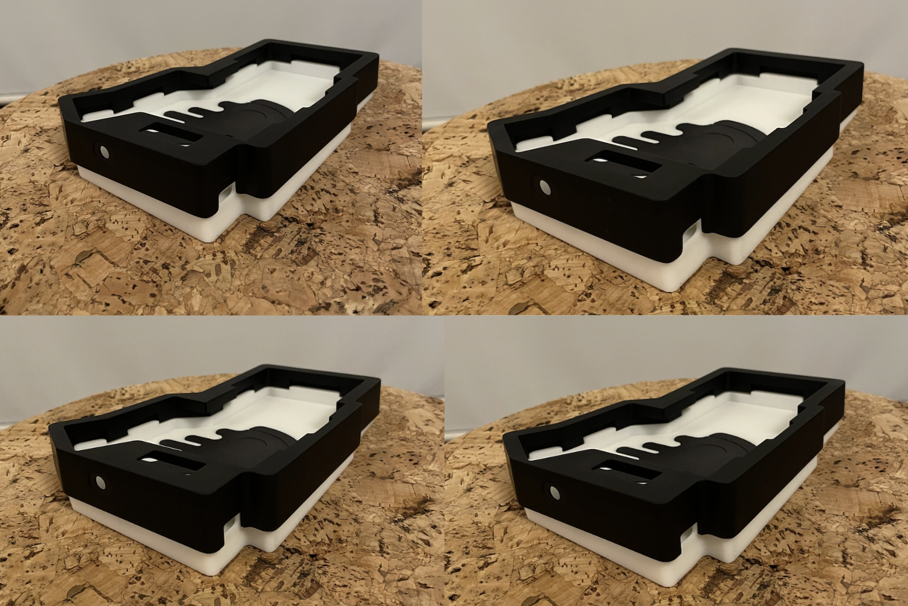

この記事は, [ikeji@](https://twitter.com/ikeji) さん主催の [キーボード#1 アドベントカレンダー 2023](https://adventar.org/calendars/8789) 10 日目の記事になります.

## はじめに

[Corchim](https://kbd.arashike.com/corchim) をひとことで説明すると [foostan@](https://twitter.com/foostan) さん作成の [crkbd](https://github.com/foostan/crkbd) のガスケットマウントキーボードケースです.
2023-12-31 まで [https://kbd.arashike.com/corchim](https://kbd.arashike.com/corchim) にて GB 開催中なのでぜひこの機会にご参加ください.

普段からどっぷり自作キーボード沼に浸かっておられる皆様におかれましては少々退屈な内容になってしまうかもしれませんが,
GB で苦労したところ (を共有することでもっと 40% の金属削り出しキーボードの GB が開催されてほしいという願い), Corchim 自体についても知ってほしいので,
筆を取ることにしました.

## 目次

- 何から始める GB ??
- なんで金属削り出しちゃったの??
- こだわった部分
- 謝辞

## 何から始める GB ??

GB を始めるためには結構前準備がいるなーっというのが GB を始めてみた感想です.
準備しないといけない OR 準備しといたほうがよさそうなものとしては以下の通り.

- geekhack ([Corchim の IC geekhack](https://geekhack.org/index.php?topic=121653.0))
  - 投稿の入力が 199x - 200x 年くらいの入力フォームでこれがしんどい
  - 返信のときも spam 防止用の recaptcha 的なのを入れる必要があるのもしんどい
- アンケートフォーム
  - google form を利用しました
    - 感想: 自分がかっこいいと思ってる色があんまり人気なくてサンプルの色がいい! とか言われるのはある程度覚悟しておいてもいいかもしれません
- Discord
  - GB の透明性 (ばっくれたりしないかとかそういう) のためにも連絡できる口は作ってくれ! って言われたので作りました. ある方がいいと思います
- 製品ページ OR 販売ページ
  - 製品が紹介できてなお且つ GB 参加までできるページは必須ですね
  - 自分は backend に shopify graphql API を使ったので, この辺の話は違う記事でするかも OR しないかもしれないです
- キーボードそれ自体
  - ある程度の量産に耐えうる工程, 構造
    - コスト面で極端に小さい内 R があるとかそういうの
  - 自分用やからこれでええやろみたいに作ってた職人芸みたいな部分はある程度の数を作るにあたって, ちゃんと図面を引いたり文字で説明できるようになっているといいかもしれません

## なんで金属削り出しちゃったの??

- ワイは 40% カラムスタッガード派の人間
  - 様々な金属キーボードがあるのに 40% 金属削り出しは珍しい (もっというと左右分割はほぼない)
    - コスト面: 左右分割にすると 2 個削り出してるのと変わらんコスト感...
    - 人気面: 40% はやはりニッチですね
- カスタムキーボード (まさかりが飛んできそうですがここでは金属削り出し各種キーボードという定義にしておきましょうか) の打鍵感, 打鍵音も好き

つまり **自作キーボード x カスタムキーボード** の夢のコラボレーションが欲しいというモチベーションで作りました.

## こだわった部分

### 打鍵感

カスタムキーボードの打鍵感を再現するために, いくつかのガスケットマウントキーボードを購入したり,
各種イベント ([キー部](https://keeb.connpass.com/)や[天キー](https://tenkey.connpass.com/)など) で先人たちの至高のキーボードを試打させていただきました.
結果的に打鍵感 (これは打鍵音に関しても言えることだと思いますが) はこれをひとつやったら完璧みたいなものがなく,
総合点で評価されるものだということがわかりました.
構造的 (2 ピースの構造) に

- top body (上側のケース)
- gasket (上側)
- switch plate
- gasket (下側)
- bottom body (下側のケース)

というのが基本的なガスケットマウントキーボードの構造だと思いますが, 注目すべきは上下の gasket をどれくらい潰すのかという点です.
取りうる選択肢をある程度絞って列挙すると

- 素材
  - PORON
  - シリコンゴム
  - 不織布 (ヒメロンってのがあります[https://www.ambnfk.com/product/himelon/](https://www.ambnfk.com/product/himelon/))
- PORON (今回はどれも実際に切ってみて, PORON にすることに決定したので) の硬さ
  - LE-20 (キーボード界隈ではこれが一般的かな)
  - LE-32
- PORON の厚み
  - 2mm
  - 3mm
- PORON をどれくらいつぶすか
  - これに関しては一応 [こちら](https://www.reddit.com/r/MechanicalKeyboards/comments/ulnj5h/i_need_help_making_poron_gasket_mounted_keyboard/) に reddit の記事があります...

っと, これだけでもかなり選択肢が多く試作するだけでも一苦労です. [Corchim](https://kbd.arashike.com/corchim) においては
(個人の趣味に依存しているところも大きいですが), 以下の素材について試作をおこないました

- シリコンゴム 2mm: 硬度 50, 70 でおこないましたが, 思ったよりつぶれず反発が強すぎたため不採用
- PORON LE-20 2mm: 歴史に学べばよかったのかもしれん... けどやっぱ自分で試してみたいやん??
- PORON LE-32 2mm: 20 と 32 でほぼ誤差がないかなと思ってたんですが, 32 は意外と固く潰しすぎるとあまり意味がなさそうなので採用を見送りました
- ヒメロン (不織布) 2mm: 片面粘着にするのがしんどかったので採用を見送りました. ただ, 上下のケースの間に直接挟み込むようにすると打鍵音に関しては向上が見られました

その上で, 今度は PORON LE-20 2mm をどれくらいつぶすかってのを実験するために潰れる距離が 0.25 mm 刻みになるようにケースを試作しました.

### 打鍵音

こちらも理想の打鍵音になるようにいくつかのキーボードを試したり, 試作をおこないました.
結論から言うとこれも様々な mod などあるかとは思いますが, これをやったら完璧!!っというものはなく,
総合評価なんだなーっということがわかってしまいました...

こちらは構造的に

- (厳密には上下の gasket も入ってくる)
- switch plate
- switch plate と PCB 間のフォーム
- PCB
- PCB と bottom case 間のフォーム
- bottom case

という構造になっていて中に詰めるフォームの距離をどのように敷いていくかがポイントになるかと思います.
ヒメロンを取り扱ってる業者の人に電話でお見積りをしてもらった際に相談させていただいたのですが, 防音には

- フォームをみっちみにつめて吸収させる
  - クリアランスより少し厚めのフォームを採用することで密度を上げる
    - e.g switch plate - PCB 間は通常 3.5mm だと思いますが, ここに 4mm のフォームをしく
- 異種の素材 (例えばここなら bottom case のアルミとフォームとか) 間にものすごく小さい隙間を設けて反響させる

この 2 種類があるそうです. ちなみに後者のケースは車のドアを閉めるときの音がバーンっと響かないようにするテクニックらしく,
その業者さん曰くですが, 決まった計算式みたいなのがあるわけではなく,
先にドアができてから中に入れる素材を適宜調整しつつ音を比較するそうです (とはいえ各社クリアランスと素材の組み合わせの最適解みたいなものは持ってるやろっとは思っています) .

これも今回の試作では

- switch plate - PCB 間は
  - みっちみち
  - 3.5mm ぴったり
- PCB - bottom body 間は
  - みっちみち
  - ぴったり
  - 打鍵時の沈み込みを考慮してわざと隙間を作る
    - 隙間: 0.15 mm
    - 隙間: 0.3 mm
    - 隙間: 0.5 mm
    - 隙間: 1 mm

を制作して試してみました.

PORON LE-20 3mm をカットするときの出力です. 参考に使ってください.

### typing edge

タイピング角度は非常に重要な問題 (少なくともワイにとっては) で,

1. ゴム足の高さを変える
2. 3D プリントでいくつかの角度で試す

という工程で試験をおこないました.
ワイの手の大きさにも多少は依存するかもしれませんが, テントの角度は結構重要で

- 10°
- 7°
- 5°
- 4°
- 3°

という順番で角度を下げて試していったのですが, 10° はもはやケースとしてのデザイン性を無視せざるを得ない形をしていてｗ,
今回は見送りました...
その中で 4° であれば極端にケースとしての外観を崩さずに且つ無理のないタイピング角度ができるというのがお試し段階での感想です.
ただこういうのはキースイッチと一緒でその場でちゃちゃっと試しただけでは正直わからんので,

- 5°
- 4°
- 3°

をそれぞれ 2 週間ずつ仕事で使ってみることで腕が痛くならないか, 無理な姿勢になっていないかを確認していきました.
(別途 チルトの角度についても考察がありますが, ほぼ同じ内容なので今回は省略します.)
最終的に現在の 4° に落ち着きました.

### そこそこかっこいいケース

(自分としてはかなりかっこいいとは思っているんですが, 皆さんの様々な意見があると思いますので, そこそこかっこいいということにさせてください. )
top body で bottom body の底までまるごと被せてもよかったのですが, top body の製造コストや背面, 正面から見たときのスマートさを考えたときに,
bottom body が少し見えてる方がスマートだなという結論になりました.

実はここは難しくて, 3D CAD 上で見ているとそこそこバランスよく見えていても,
実物は斜め上から見ることが多く (通常自分のキーボードを打鍵しているときに見えるのはだいたい斜め上からの角度ですよね??),
実物を見ると "思ってたのと違う..." っとなり, 見える部分の比率に黄金比を使ったり, 色違いでケースを出してみたりしてかっこよさげなものを
追求してみました.

(コレ... すべて違う背面の高さです)

結果として自分としてはかなり満足度の高いケースができました!!
(先日の天下一キーボードわいわい会 Vol.5 に持っていったのですが, そのときの写真を見て購入したよっていう DM でもらえて嬉しかったです.
そのときの写真は [こちら](https://kbd.arashike.com/_next/image?url=https%3A%2F%2Fcdn.shopify.com%2Fs%2Ffiles%2F1%2F0624%2F3326%2F3775%2Ffiles%2Fby-ai03_c4243475-7913-4af9-be10-17d2f4207217.png%3Fv%3D1701091113&w=1920&q=75) です. )

## 謝辞

この場を借りて(借りるのが正しいのかはわかりませんが), Corchim の GB Open までに様々な人と関わることができ, めちゃくちゃ感謝なので謝辞です (順不同).

- [foostan](https://twitter.com/foostan) さん, crkbd という素晴らしいキーボードを作ってくれたこと, DM でライセンスについて問い合わせたときもソッコーでレスをもらって感謝です
- [L4Ph](https://twitter.com/R0u9h) さん, Discord で販売予定はいつ??って聞いてくれなかったら正直自分用になってたかもしれませんｗ イベント会場でも楽しくおしゃべりさせてもらって感謝です
- [Daihuku](https://twitter.com/Daihuku0015) さん, 動画作って欲しいというわがままなお願いにも快く対応していただいて感謝です
- [ほぼ週間キーボードニュース](https://www.youtube.com/channel/UCyU1PAGvw_suAyI4wljHmag) さん, Corchim の GB 紹介してもらってありがとうございます
- [サリチル酸](https://twitter.com/Salicylic_acid3) さん ("さん" を 2 回いってもいわくてもいいってブログに書いてました), 週報で GB 紹介してもらってありがとうございます
- [ai03](https://ai03.com/) さん, レジェンドにはキー部でフォームのカットってどうしてるのかをお伺いさせていただきました
- [けぺお](https://twitter.com/kepeoo)さん, 天キーでやっとお会いできて楽しくおしゃべりさせてもらってしかもそのまま GB ご参加いただいて感謝です

他にもたくさんめちゃくちゃいろんな人の力をお借りすることで, めちゃくちゃ楽しく GB を開始することができました. これからもよろしくお願いします!!
最後にまだ GB [https://kbd.arashike.com/corchim](https://kbd.arashike.com/corchim) を受け付けているのでぜひぜひご参加くださいませ!!

この記事は試作版 [Corchim](https://kbd.arashike.com/corchim) を使って書きました.
明日は, [74th@](https://twitter.com/74th) さんの [M5Dial をトラックパッド化する](https://74th.hateblo.jp/entry/m5dial-trackpad) です, お楽しみに!!
