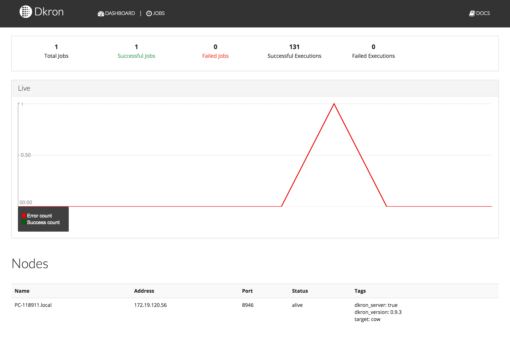
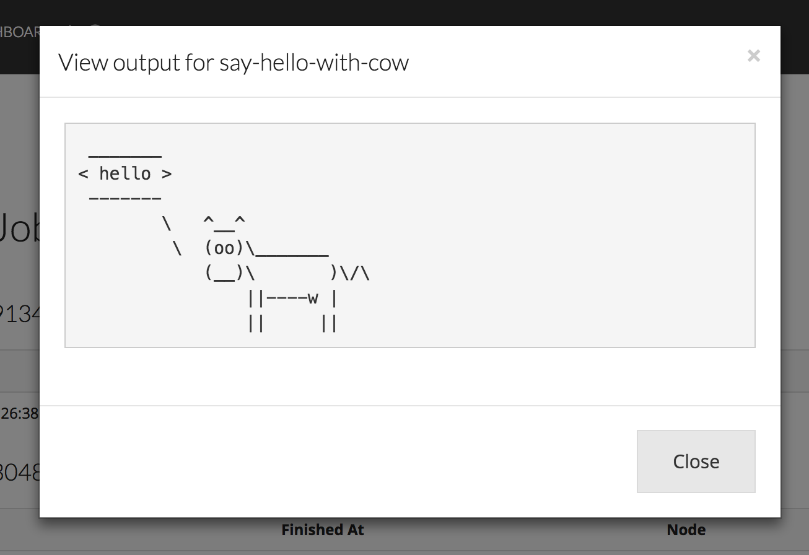

## outline

### ここで説明されること

- consul 概要
- dkron でできること

### ここで説明されないこと

- consul 詳細
  - multidata center とかそういうの
- dkron vs xxx (Chronos とか)
  - Chronos は airbnb 製の cron 一元管理システムで、サーバや container に cron を持ち込むのをやめましょう的なもの。cron の中身を一元管理して、tag 付けされたサーバ上でのみ実行するというもの

## dkron

dkron は etcd, consl, zookeeper をジョブの KVS バックエンドとして使うジョブスケジューラーです。主な機能としては

- フォールトトレラント
  - leader node を選出して、その leader node が他の follower に対して job の実行を指示します
  - leader node が死んだ場合、cluster 内の follower が leader に昇格して、follower への指示を続投します
    - その際、job の設定(どのサーバでジョブを実行するとか、何時にキックするとか)は backend KVS に保存されているので、jenkins でいう master が死んでも無問題です
- server のタグ付け
  - どの job をどの server で行いたいかをタグ付けすることで決定できます
- json API による job の設定
  - json を POST することで job の設定が可能
  - POST method を使って job のキックも可能
- `parent_job` を設定することで、job の chaining も可能
- job の成否通知
  - slack incoming webhook URL を指定することで、job の成否を slack で通知できます
  - mail 通知
- web ui
  - web ui もついて来ちゃいます
- plugable!!
  - あまり開発は盛んではないようですが、plugin 機構を搭載しているので third pirty 製の plugin を使用することも可能です
- datadog にジョブの成否を送ってくれる
  - dkron の起動オプションに `-dog-statsd-addr` と `-dog-statsd-tags` があって、tag を指定して metric を送信できちゃいます

## consul

consul は service discovery middleware で、サーバグループを cluster 化して、tag 付できるようになり、redis のサーバはこれですよーみたいなことを consul agent を通して行うことができます。また、consul cluster の quorum は `(n/2) + 1` の majority members を採用しています。

### step0 installing

```
$brew install consul
```

### step1 waking up

本来は KVS データの保持と cluster の健全維持のため 3 or 5 servers で cluster を立ち上げろとのことですが今回は 1 台で立ち上げましょうかね。

```
$consul agent -server -bootstrap -ui -data-dir ~/tmp/consul-data/ -bind 127.0.0.1
```

#### 各オプションの説明

- -server: サーバーモードで起動(server モードと client モードがあり、client は KVS 各種コマンドを server node へ forward したり、health check だけを行うような軽量なプロセスです)
- `-bootstrap`: `-bootstrap-expect 1` と同義で、cluster のサーバ台数を 1 台に指定します
  - `-bootstrap-expect 3` と実行すると cluster に 3 台が入ってくるまで election leader を待つ動きになります
- `-ui`: ${bind_addr}:8500 に consul cluster の UI が見れます
- `-data-dir`: cluster 管理や、node-id などのデータを置いとくディレクトリです
- `-bind`: 複数の private IP を持つマシンではこのオプションを有効にしてどの IP で bind するか決めます

これで consul cluster(1 台だけですが)が立ち上がりました。

## dkron

### step0 installing

golang 勢の方は `https://github.com/victorcoder/dkron` を clone して、

```
$ cd dkron
$ glide install
$ mkdir bin
$ go build -o bin/dkron
```

で自前 build でもいいんやで??

近道派の人は [https://github.com/victorcoder/dkron/releases](https://github.com/victorcoder/dkron/releases) から binary を直接取ってくるのも可

or

[http://dkron.io/docs/getting-started/](http://dkron.io/docs/getting-started/) に `apt-get install` で入れる方法も書いてあるのでそちらもどうぞ

### step1 waking up

```
$ dkron agent -server  -backend-machine=127.0.0.1:8500 -join=127.0.0.1 -backend=consul
```

このコマンド一発で起動できます

#### 各種オプション

- `-server`: server モードで起動
- `-backedn`: backend KVS として consul を使う
- `-join`: どの cluster に join するか
  - ここでは 127.0.0.1 に consul を立ち上げているので consul に join するために 127.0.0.1 を指定しています
- `-backend-machine=127.0.0.1:8500`: backend の KVS に join する API の hostname:HTTP_PORT
  - 現状の実装(2017/03/23 現在)だと HTTP を使って conosul cluster の API 叩いてるぽいので consul におしゃべりするためのポートは 8301 ではなく 8500 を指定する

これで dkron も立ち上がり成功です。
正しく立ち上がると`http://127.0.0.1:8080`にこんな感じの



管理画面が立ち上がってきます。

各種オプションは[json で config](http://dkron.io/docs/configuration/)ファイルを作成することも可能ですし、`DKRON_BACKEND`のように環境変数で指定することも可能です。

### step2 executing jobs

dkron は job の投入を[Restful な API](http://dkron.io/docs/api/)で行うので、まずは簡単な job を投入してみましょう。
投入前にまずはジョブが空なことを確認するために、

```bash
$ curl http://localhost:8080/v1/jobs
[]
```

で空の配列が返ってくることを確認 👀

```json
{
  "name": "say-hello-with-cow",
  "schedule": "@every 10s",
  "command": "cowsay 'hello'",
  "shell": true,
  "concurrency": "allow"
}
```

こちらの josn を

```bash
$ curl -X POST -H "Content-Type: application/json" http://localhost:8080/v1/jobs -d @say-hello-with-cow.json
```

curl で POST すると 10 秒おきに cowsay コマンドが実行されるはずです。
[実行された job の一覧](http://localhost:8080/dashboard/jobs/say-hello-with-cow/executions)を確認するとこのように



標準出力に吐き出された内容も出てきます。

### step3 tagging server

server に tagging する前に、先の `say-hello-with-cow` ジョブを削除しましょう。

```bash
$ curl -X DELETE http://localhost:8080/v1/jobs/say-hello-with-cow
```

先の json をちょこっと編集して、`tags` をくっつけました。

```json
{
  "name": "say-hello-with-cow",
  "schedule": "@every 10s",
  "command": "cowsay 'hello'",
  "shell": true,
  "tags": {
    "target": "cow"
  },
  "concurrency": "allow"
}
```

tags には `{"key": "value"}` の形で key-value をセットすることが可能で、この形でセットした tag が付いているサーバでのみ対象のジョブを実行させることができます。それでは同様に

```bash
$ curl -X POST -H "Content-Type: application/json" http://localhost:8080/v1/jobs -d @say-hello-with-cow.json
```

ジョブを投入。すると、say-hellow-with-cow job の実行履歴([http://localhost:8080/dashboard/jobs/say-hello-with-cow/executions](http://localhost:8080/dashboard/jobs/say-hello-with-cow/executions))には何も残っていないのが分かるはずです。
ここで、dkron server を tagging して起動してみましょう。

```bash
$ bin/dkron agent -server -backend-machine=127.0.0.1:8500 -join=127.0.0.1 -backend=consul -tag "target=cow"
```

先程の起動コマンドに`-tag "target=cow"`をセットして起動させました。

### step4 recovering

んでは最後に dkorn process を落として、障害復旧をやってみましょう。
まずは Ctrl-C で dkron を叩き落としてください＼(^o^)／すると

```
INFO[2017-03-23T16:51:23+09:00] agent: Gracefully shutting down agent...      node=YOUR_NODE_NAME
```

的なログが出てくるとはず(地味に Ctrl-C で gracefully shut down してくれるってすごくないすか)。

んでもって

```
$ dkron agent -server  -backend-machine=127.0.0.1:8500 -join=127.0.0.1 -backend=consul -tag "target=cow"
Starting Dkron agent...
INFO[2017-03-23T16:53:39+09:00] agent: Dkron agent starting                   node=YOUR_NODE_NAME
INFO[2017-03-23T16:53:39+09:00] agent: joining: [127.0.0.1] replay: true      node=YOUR_NODE_NAME
INFO[2017-03-23T16:53:39+09:00] agent: joined: 1 nodes                        node=YOUR_NODE_NAME
INFO[2017-03-23T16:53:39+09:00] api: Running HTTP server                      address=:8080 node=YOUR_NODE_NAME
INFO[2017-03-23T16:53:39+09:00] agent: Running for election                   node=YOUR_NODE_NAME
INFO[2017-03-23T16:53:39+09:00] agent: Listen for events                      node=YOUR_NODE_NAME
INFO[2017-03-23T16:53:39+09:00] agent: Cluster leadership lost                node=YOUR_NODE_NAME
INFO[2017-03-23T16:53:39+09:00] agent: Cluster leadership acquired            node=YOUR_NODE_NAME
```

的なログがバラバラっと出てくるはず。1 台の dkron cluster でしたので、当然落とすと leader が死んじゃうのですが、もう一度起動すると自分自身が leader になって(Cluster leadership acquired の部分です)立ち上がってきます。もちろんジョブの設定は consul cluster に残っているので、そのまま先程の say-hello-with-cow ジョブが実行されます。

## まとめ

- Pros:
  - leader node の仕事をほかの follower が引き継いでくれるので耐障害性イケてる
  - 誰が leader node かは関係ないので、cluster 管理が割りと楽
  - consul(または etcd, zookeeper)の cluster 管理に乗っかれる安心感
  - multi data center ジョブ実行もできちゃうよ
  - golang 製なのでたったひとつの binary だけで実行できるというお手軽さ

* Cons:
  - job の投入が json API
    - json をバックアップしとけばいいって話ではあると思います
  - ほしいサーバ数をほしいだけみたいな感じではなく、あくまで cron の分散実行という感じなので、最終的な resource 管理は人に委ねられる

っとまぁこんな感じで、実行させたいジョブをいい感じに分散実行してくれるので、batch サーバが、、、、、みたいな方にはよいんじゃないでしょうか??
