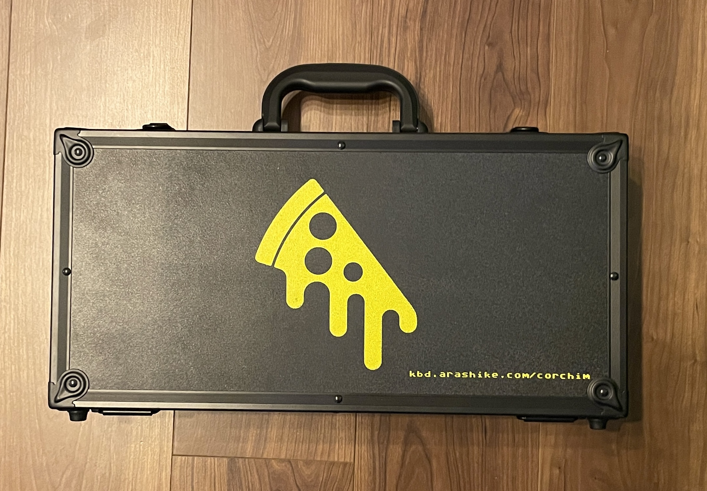
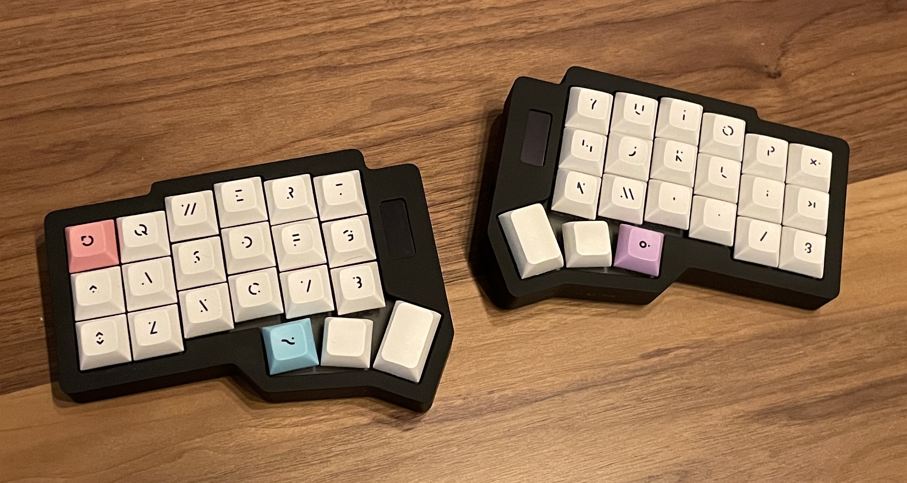

[キーケット (2024 年分)](https://keeb-market.jp/) の kbd.arashike.com のお品書きです.

## お詫び

[Corchim](https://kbd.arashike.com/corchim) スペースグレー(製品版: スペースグレーボディ + PVD Black ウェイト) を持っていく予定でしたが,
工場からの発送が遅延してフォームのみしか手元に届かなかったので, 今回は試作品のみの発売となりますことご了承くださいませ.

## Corchim について

Corchim は [foostan@](https://twitter.com/foostan) さん作成の [crkbd](https://github.com/foostan/crkbd) のガスケットマウントキーボードケースです.

## 概略

- ブース: A-8
- サークル名: [kbd.arashike.com](https://kbd.arashike.com)
- 出展物一覧 (今回はすべて [Corchim](https://kbd.arashike.com/corchim) シリーズとなります)
  - アルミ切削: 黒 (試作で出したもので, 細かい傷があるため B-stock 扱)
    - 価格: 30,000 JPY
      - キャリングケース不要な方は ▲5,000 JPY
      - キャリングケースが売り切れた場合はキャリングケースのみ後日配送 OR ▲5,000 JPY となります
  - アルミ切削: グレー (試作で出したもので, 細かい傷があるため B-stock 扱)
    - 価格: 30,000 JPY
      - キャリングケース不要な方は ▲5,000 JPY
      - キャリングケースが売り切れた場合はキャリングケースのみ後日配送 OR ▲5,000 JPY となります
  - 3D プリントバージョン: 白
    - 価格: 15,000 JPY
      - キャリングケース不要な方は ▲5,000 JPY
      - キャリングケースは後日配送となります
  - 3D プリントバージョン: グレー
    - 価格: 15,000 JPY
      - キャリングケース不要な方は ▲5,000 JPY
      - キャリングケースは後日配送となります
  - 3D プリントアルファバージョン: ???
    - 当日までに部品が間に合えば...

## キャリングケースについて

↑ キーケットに持ち込むキャリングケースの実物 (試作バージョン)

- 持ち帰りたい方: 試作版になっちゃいますが、大歓迎です. そのまま商品といっしょにお持ち帰りくださいませ
- 後日発送がよい方: 1 ヶ月以内くらいにワイの手元に届くはずなので, 商品+キャリングケース OR キャリングケースのみの後日発送が可能です
- 不要な方: ▲5,000 JPY です

## アルミ切削: 黒

- アルミ切削
- 試作品 (ただし寸法は製品バージョンと同じです)
  - 表面に細かい擦れキズなどありますので, B-Stock 価格で販売です
- 金額: 30,000 JPY
  - キャリングケース

## 注意事項

- crkbd の PCB は含まれませんのでご了承ください
  - ※もしかしたら当日ワイがはんだしたものを持っていけそうな気もするので, 必要な方は一言お声がけください
