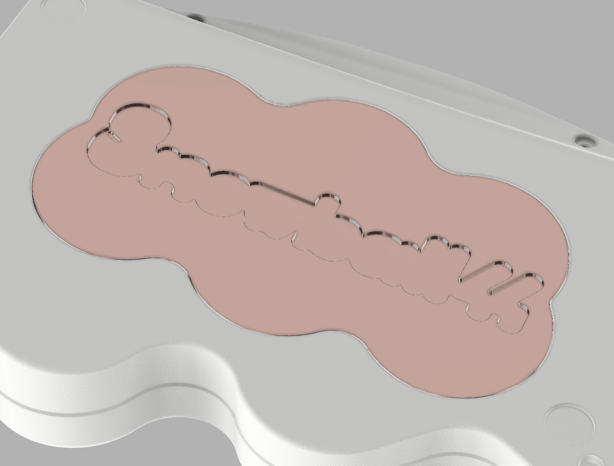

この記事は, [ikeji@](https://twitter.com/ikeji) さん主催の [キーボード#1 アドベントカレンダー 2024](https://adventar.org/calendars/10025) 16 日目の記事になります.
昨日は 大岡俊彦 さんの [【キーボード】打鍵姿勢について考えた](http://oookaworks.seesaa.net/article/505704463.html#gsc.tab=0) でした. 大岡さんらしい読みやすい文章でめっちゃおもしろかったです.
明日は Ratata aka ラッタッタ さんの "たぶん今年手にしたキーボードをまとめまます" になる予定っぽいです.

## はじめに

まずはじめに, Corchim の GB に参加してくれた皆さん, なんらかの形で Corchim を使ってくれてる皆さん, ありがとうございます!!
キーケットに向けて作っている金属削り出しガスケットマウントキーボードケースについて筆を取ることにしました.

## 目次

- Snowball44
- cocochim36
- 謝辞

## Snowball44

結論から先に書くとコレを [けぺお](https://x.com/kepeoo) さんと作っています.
ﾊｲ, みんなコレを待ってた! Keyball44 の金属削り出しガスケットマウントケース, その名も **Snowball44** です!! 今日はコレだけ覚えて帰ってください.
Corchim で得た知見と教訓 (もしかすると一定のユーザにはカラーリングや完成品のクオリティや精度についてご迷惑をおかけしてしまったかもしれません) を活かした作品となっています.

### こだわりポイント

#### typing edge

細かいところは商品ページを作ってからにしようかなとは思っていますが, typing edge は今回も

- 4° のテント
- 3° のチルト

に落ち着きました.

#### 全体的に丸みを帯びたデザイン

んまぁ曲線が多いです. 初期構想だとこんな感じでドバーッとスケッチを書いたりけぺお先生と共有したりしてました.

Corchim はエッジを立たせた比較的カクカクっとしたデザインですが, 今回はかなり曲線を意識してます. (円の直径は困ったら x1.618 するとよいです)
トラボ直径の 34mm を起点に x1/1.618 したり x1.618 して不自然にならないように曲線とキーの位置を調整しました.

#### ええ感じの打鍵感と打鍵音

Corchim での経験により, 自分としてはいい感じの打鍵感と打鍵音と, どれくらい Poron フォームを潰していくかの肌感が得られましたので, 今回も似たような打鍵感に仕上がると思ってます.

- (動画取ったら載せときます)

#### 鬼才けぺお先生のトラボケース

けぺお先生と今回コラボさせていただくにあたって, ベアリングトラボケースの作成をお願いさせていただきました.
(その他にもケースデザインの相談, レビュー, ほぼほぼけぺお先生の作品と言ってもなんら過言ではありませんが, 細かいとことは謝辞で述べます.)
Keyball ユーザの皆さんはすでにけぺお先生のトラボケースを使っていると思いますが, ベアリングのｼｬｰｯ感がすごい!!

#### 圧倒的にかわいいロゴ

こちらもけぺお先生が考えてくれたロゴです. 詳細はプロトタイプ OR 製品 version が届いたときに紹介させていただきますが, めっちゃかわいいロゴです.

## cocochim36

こちらは [KEEB_PD_R218](https://x.com/hashtag/KEEB_PD_R218?src=hashtag_click&f=live) でも紹介させていただきました, cocot36plus v2 用の金属削り出しガスケットマウントケース, cocochim36 (仮称) です.
こちらもキーケットでの販売を目指して鋭意ブラッシュアップ中です.

### こだわりポイント

#### トラボケース

(平面のトラボケースはハードルが低目ではありますね...) もっちょりした感じっすね
0.x mm の寸法違いをたくさん作って, すっぽぬけないかとか加工誤差のチェックを行うので, どうしてもほぼ同じものが大量にできてしまいますね...

オリジナルがリングエンコーダなので, ちゃんと回せるようになってます. ケースを作るにあたっては [specification (mouser のサイトでホスティングされてます)](https://www.mouser.jp/datasheet/2/54/per60-2930501.pdf) にかなり細かくサイズが書いてくれてるので, 気になる方はここを参照してください.

#### 背面の weight とロゴ

予算が見合えば銅の削り出し, 見合わなければ SUS になります...

#### ええ感じの打鍵感と打鍵音

いつも通り, ここは時間と厚みを試行錯誤しました (まだしていますが正しいかも).
前回は PORON, シリコンゴム, 不織布 と試しましたが, 今回は PORON を主軸におしつぶす厚みをいろいろかえて試行錯誤しました (Snowball44 と同じともいふ).
ある程度期待していただいてよいかなと勝手に思ってます!!

## schedule

販売の予定など

- キーケット 2025: 2025-03-22
  - (めっちゃ爆速で売れたりしちゃったら) GB を予定してます
- お知らせ場所
  - Discord: [https://discord.gg/tuykB7h5d9](https://discord.gg/tuykB7h5d9)
  - x: [https://x.com/jupemara](https://x.com/jupemara)
  - latest updates を書くなら: [https://kbd.arashike.com](https://kbd.arashike.com)

## 謝辞

去年のけぺおさんの twitter を見て (次回は出店側で!), キーケット一緒に出れたらいいなぁと思いお誘いさせていただきました.
ボールケースだけでなく, デザインや仕上がりのレビュー, ロゴ作成, 機能や干渉部分のレビュー等かなり細かいところまで伴走していただいて, 圧倒的感謝です!!
まず試作第一号はけぺおさんの元に届くことになると思います.

っというわけで皆さんキーケット OR GB をお楽しみに!! この記事は [cocochim36 (仮称)](https://x.com/jupemara/status/1842867920747254026) で書きました.
