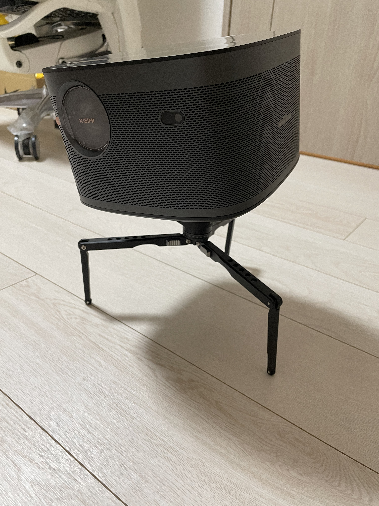
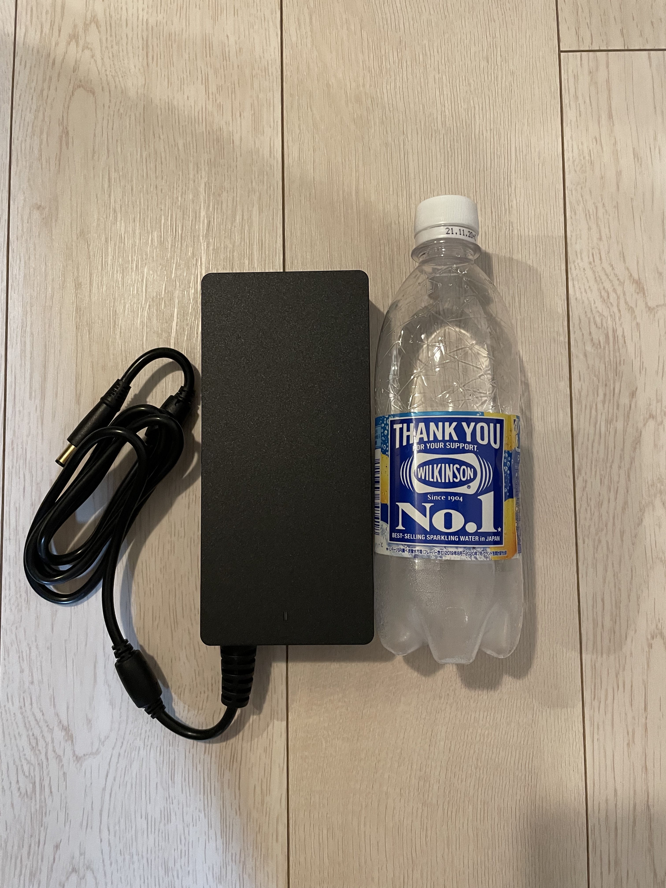
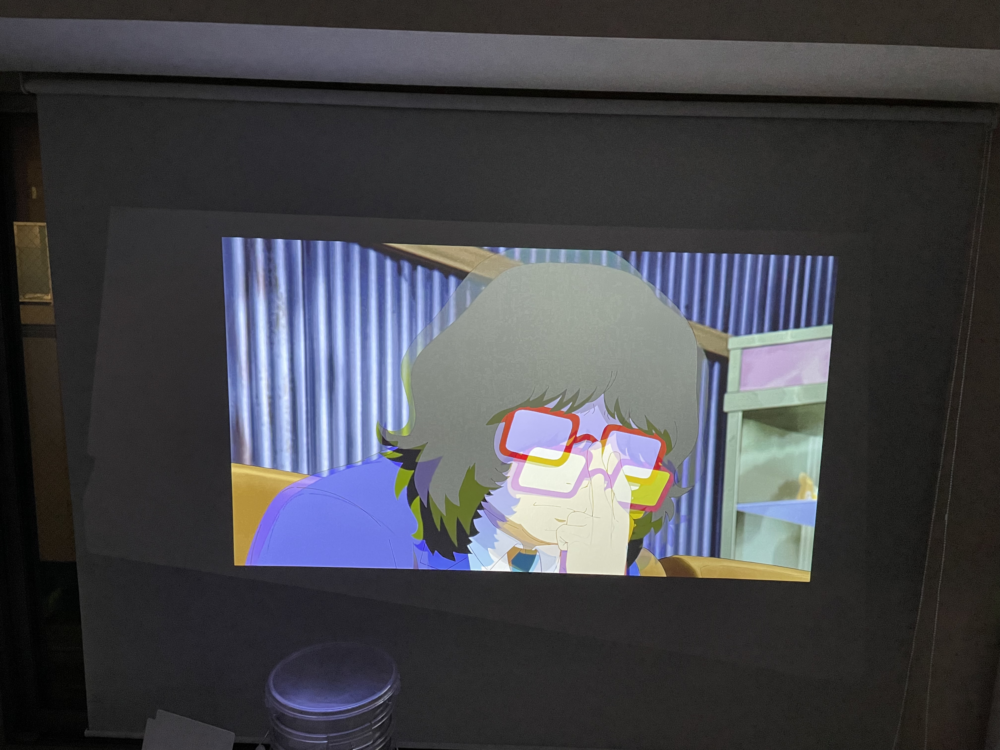

7 月 1 日に新居に引っ越しました。新居の窓は横幅が 2m 以上あって結構でかめなので、コレを気にプロジェクター(小学生の頃、親戚の家でプロジェクターを初めて見て、いつかこの大画面でゲームできたら楽しいやろうなーと思っていました。)を導入してみようと思いました。

## outline

- 目的&背景
- 要件
- 調査した機種たち
- Horizon Pro レビュー
- まとめ

## 目的&背景

ワイは学生時代に独り暮らしを始めてというもの、人生でテレビを買ったことがないです。今もテレビは不要だと思っています。なので、デカイディスプレイ(40 インチ以上)が家にあった経験はほぼないです(実家はある)。テレビ(エンタメディスプレイ)代わりとしてプロジェクターを採用することにしました。

## 要件

予算は 200,000JPY です。

### required

- 画質: 4K
  - 4K or FHD どっちにするか
    - PS5 をつないでゲームを 4K 画質でやりたかった
      - エモいゲームが目的なので 4K/60p でいい。4K/120p はゲーミングディスプレイでやる予定
    - Netflix の 4K 契約してるし
- リフレッシュレート: 4K/60p
  - 最低限 PS4 Pro の画質がほ C
- できるだけ小さいの
  - カウンターキッチンの上に置きたかったのでできれば 300mm 四方くらいでおさまってほしかった
- ズーム
  - 光学ズームできるのがよかったんですが、高すぎたのでデジタルズームで我慢しました
  - 将来的に引っ越す予定(今の家は賃貸)なので多少融通がきく方がいいなと思ってなんらかのズームが欲しかったです
- 水平方向台形補正
  - 垂直方向のみだとどうしても天井に吊ったり、かなりでかめの三脚が必要になりそうだったので、水平方向台形補正は必須でした
    - ダクトレール吊りはアリやったんですが、各種機器への HDMI ケーブルが天井から降ってくることを考えたら、無理ゲーってなりました

### optional

- HDMI ARC
  - 将来的にサウンドバー(Sonos Beam)をつないでみたい
- スピーカー: 8W 以上
  - 特に何か決め手があったわけではないんですが、なんとなく(最悪外付けのスピーカーでいいやと考えていました)
- HDMI 入力 x2 以上
  - SWITCH やら PC やら PS5 やらを差し替えるのがめんどいので、HDMI 入力が 2 ポート以上ほ C
- 単体で動くソフトウェア同梱
  - just プロジェクターでもよかったんですけど、Netflix+ゲームが用途(プレゼンとかはしない)なので、お気軽にメディアが見れればいいなと

## 調査した機種たち

### Anker Nebula Capsule2

<iframe
  style="width:120px;height:240px;"
  marginwidth="0"
  marginheight="0"
  scrolling="no"
  frameborder="0"
  src="//rcm-fe.amazon-adsystem.com/e/cm?lt1=_blank&bc1=000000&IS2=1&bg1=FFFFFF&fc1=000000&lc1=0000FF&t=araottii-22&language=ja_JP&o=9&p=8&l=as4&m=amazon&f=ifr&ref=as_ss_li_til&asins=B07QBXMY2Z&linkId=be1aac6e49136b692f449f95f55a43ac"
></iframe>

モバイルプロジェクターといえばド定番ですよね。正直これでもいいかなーって思ってたんですが、画質が 720p やったので、コレはやめました。また水平方向台形補正もないのでコンパクトに置けたとしても水平方向は物理調整が必要なので候補から外しました。

### Anker Nebula Cosmos

<iframe
  style="width:120px;height:240px;"
  marginwidth="0"
  marginheight="0"
  scrolling="no"
  frameborder="0"
  src="//rcm-fe.amazon-adsystem.com/e/cm?lt1=_blank&bc1=000000&IS2=1&bg1=FFFFFF&fc1=000000&lc1=0000FF&t=araottii-22&language=ja_JP&o=9&p=8&l=as4&m=amazon&f=ifr&ref=as_ss_li_til&asins=B08422LPS6&linkId=2cf49b95cebeb789c3270d5e239b5b14"
></iframe>

お値段次第では最悪 FHD でもいいかなと思っていた頃はコレも候補に入ってました。実際にヨドバシカメラで見てみた感じ、水平方向台形補正もあって、よさげだったんですが、FHD でこのサイズのプロジェクターかー、デカイ!!と思って候補から外しました。これなら[Anker Nebula Vega Portable](https://amzn.to/3re5sla)の方が小さくていいなって思いました。どっちか選べと言われたら迷わず Vega Portable を選びます。

### Anker Nebula Cosmos Max

<iframe
  style="width:120px;height:240px;"
  marginwidth="0"
  marginheight="0"
  scrolling="no"
  frameborder="0"
  src="//rcm-fe.amazon-adsystem.com/e/cm?lt1=_blank&bc1=000000&IS2=1&bg1=FFFFFF&fc1=000000&lc1=0000FF&t=araottii-22&language=ja_JP&o=9&p=8&l=as4&m=amazon&f=ifr&ref=as_ss_li_til&asins=B084228KGF&linkId=48c001136fdda72e80f414c15b5cf003"
></iframe>

要件は一通り満たしていて円盤みたいな(UFO みたいな)形が結構好きで、いいな！って思ってたんですが、実物を見に行ったところ思った以上にデカすぎました。しかもこの金額(Amazon AnkerDirect にて 179,980JPY)で 1500 ルーメン, 150 インチかーと思い将来性(もしもっとデカイ家に引っ越すことができればですけど)を感じられなかったので、候補から外しました。

### ViewSonic X10-4K

https://www.viewsonic.com/jp/products/projectors/X10-4K

required 要件すべて満たしてそうで、しかも Harman Kardon のスピーカー積んでてコレにしようと思っていました。そしたらその矢先に XGIMI から Horizon Pro が出るというではないですか。ただ、こちらは水平方向台形補正がないので、プロジェクタならぬ見た目のかっこよさだけでホイホイされていた感が否めません。

### XGIMI Horizon

<iframe
  style="width:120px;height:240px;"
  marginwidth="0"
  marginheight="0"
  scrolling="no"
  frameborder="0"
  src="//rcm-fe.amazon-adsystem.com/e/cm?lt1=_blank&bc1=000000&IS2=1&bg1=FFFFFF&fc1=000000&lc1=0000FF&t=araottii-22&language=ja_JP&o=9&p=8&l=as4&m=amazon&f=ifr&ref=as_ss_li_til&asins=B095CD2DKZ&linkId=f5bbf6ba1938e6bb5c4b160305d57895"
></iframe>

FHD vs 4K を悩んでいたときは、正直コレもありかなって思ってました。ただ、FHD でこの金額なら Anker Nebula Cosmos 買うかなって気持ちになったので候補から外しました。

### XGIMI Horizon Pro

https://jp.xgimi.com/pages/horizon-pro (ちょっとわかりづらいけど、仕様はここに載ってます)

これからの時代、4K 一択やろ JK と思い始めてからは X10-4K vs Horizon Pro の戦いが始まってしまいました。optional 要件の HDMI ARC, HDMI 入力が 2 ポートあるということでこちらに決めました。

## XGIMI Horizon Pro レビュー

### with 三脚

三脚[Leofoto MT-03+LH-25](https://amzn.to/3hJjnfW)(Amazon で並行輸入品を買うと安いけど、ワイは perfect customer satisfaction を常に提供し続けるヨドバシさんで購入しました)を使うとひとつ目のロボットみたいな見た目になるのがとてもいいですね(そういう意味だと Cosmos or Cosmos Max を乗せる方がロボットぽい)。

### AC アダプタのでかさよ

このサイズで 2200 ルーメンという圧倒的明るさを誇る XGIMI Horizon Pro なので、当然といえば当然なんですが、AC アダプタがめちゃくちゃでかかったです。(画像は比較のための 500ml ペットボトルです)ワイはケーブル収納用に BlueLounge のケーブルボックス(大)を使っていますが、入れると結構なスペースを食って配線難易度が上がりました。

### 台形補正の後

スクリーンの中心から 30° くらいずらしたところから照射していますが、もともとの画面サイズがうっすら写ってしまうところが少し残念です。台形修正の宿命なのでどうしようもないとは思いますが、部屋を真っ暗(プロジェクター以外なにもつけない状態。スクリーンは遮光 1 級のロールスクリーンです)にすると結構明るめに出てしまいます。Horizon Pro 本体のちょうど真上くらいに 26E のダウンライトがありますが、それをつけて少し部屋を明るくするとほとんど気にならないレベルにはなります。
ワイとしては、映像を見るときの利便性という意味では特に気になりませんでしたが、美しさという意味で少し残念な気持ちになりました。唯一残念なのはここですね。

### 音質

Harman Kardon 8W のスピーカーが 2 基ということで結構期待していましたが、ボリュームはとてもいいのですが、やや中高音の音の鮮明度に欠ける気がしました(低音で潰されているというわけでもなく)。普段 Sonos One で音楽を聞いていますが、Sonos は低音が強めに演奏されるせいで、別途アンプに出力しないとどうしても中高音の解像度が下がってしまうのですが、それと比較しても"んまぁ、普通"という印象でした。Sonos Beam を買いたい機運が高まりつつあります。

### PS5+ゲーム

4K が出力できればなんでもよかったんですが、比較的派手なエフェクトがほしかったのでモンスターハンターワールドで適当に撮影してみました。

## まとめ

4K デジタルズームができてコンパクトな水平方向台形補正プロジェクターを探している人にはかなりオススメです!水平方向台形補正は必要ないけど短焦点な 4K プロジェクターが欲しいという人には(1.77m で 100 インチが投影できる)X10-4K がいいかなと思います!
